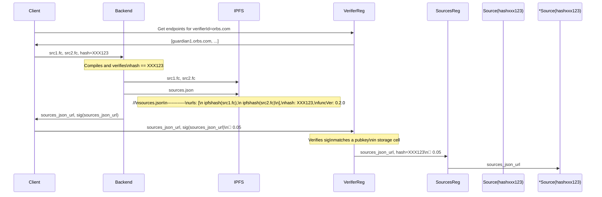

```mermaid
sequenceDiagram
participant Client
participant Backend
participant IPFS
participant VeriferReg
participant SourcesReg
participant Source(hashxxx123)
Client ->> VeriferReg:Get endpoints for verifierId=orbs.com
VeriferReg->>Client: [guardian1.orbs.com, ...]
Client->>Backend:src1.fc, src2.fc, hash=XXX123
note over Backend:Compiles and verifies\nhash == XXX123
Backend->>IPFS: src1.fc, src2.fc
Backend->>IPFS: sources.json
note over IPFS://\nsources.json\n------------\nurls: [\n ipfshash(src1.fc),\n ipfshash(src2.fc)\n],\nhash: XXX123,\nfuncVer: 0.2.0
Backend->>Client:sources_json_url, sig(sources_json_url)
Client->>VeriferReg:sources_json_url, sig(sources_json_url)\n💎 0.05
note over VeriferReg:Verifies sig\nmatches a pubkey\nin storage cell

VeriferReg->>SourcesReg:sources_json_url, hash=XXX123\n💎 0.05
SourcesReg->>*Source(hashxxx123):sources_json_url
```
